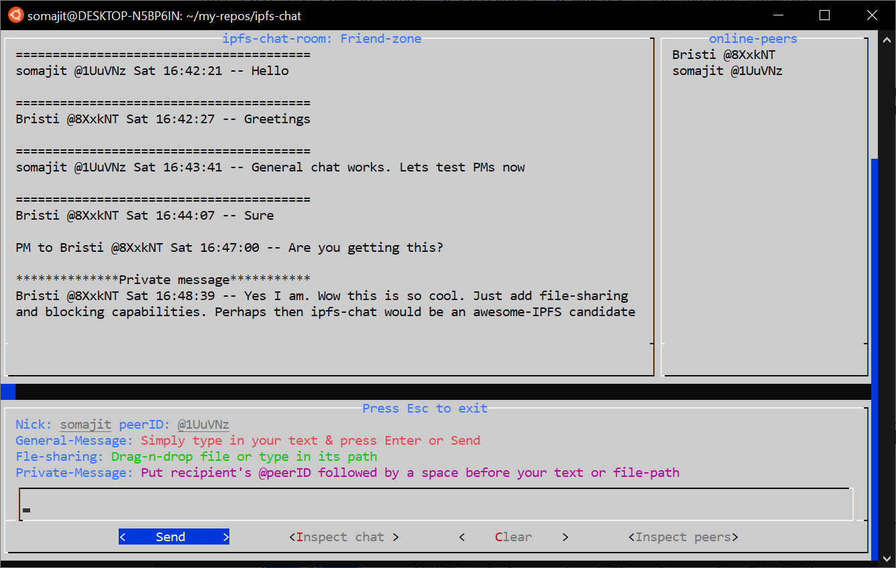

# IPFS-Chat

1. Real-time, secure, peer-to-peer messaging using [IPFS pubsub](https://github.com/ipfs/go-ipfs/blob/master/docs/experimental-features.md#ipfs-pubsub). Allows in-chat file/directory sharing and private messaging. Works over both internet and LAN. Built-in NAT-traversal using [IPFS autorelay](https://github.com/ipfs/go-ipfs/blob/master/docs/experimental-features.md#autorelay).
2. Very basic terminal-based UI without any eye candy.
3. The usual *Create Alias/Nick* + *Create/Join room* workflow (akin to [IRC](https://en.wikipedia.org/wiki/Internet_Relay_Chat)).
4. Fully distributed - serverless/brokerless. Peers are discovered using [DHT](https://docs.ipfs.io/concepts/dht/), [pubsub](https://docs.libp2p.io/concepts/publish-subscribe/) and [mDNS](https://en.wikipedia.org/wiki/Multicast_DNS) (See [Peer discovery](#peer-discovery)). No need for any rendezvous server. Without any central server(s), `ipfs-chat` cannot be censored/blocked.
5. Chat-messages are authenticated and end-to-end encrypted (See [Security](#security)). Shared files/directories are encrypted too.
6. Developed with bandwidth, CPU and disk usage efficiency in mind. Option to control shared file size (See [Usage](#usage)).
7. Written entirely in [Bash](https://www.gnu.org/software/bash/manual/bash.html); just a single shell-script. Apart from [go-ipfs](https://docs.ipfs.io/install/command-line/#official-distributions) and possibly `argon2`, depends only on standard GNU/Linux tools and tools that can be easily downloaded from the native package repository.
8. For WSL, supports sharing Windows files or folders (through direct drag-n-drop). Also allows downloading shared files in a Windows folder (See [Usage](#usage)).
9. Downloaded shared files are scanned for malicious intent (See [Security](#security) and  [Usage](#usage)).
10. Auto-update enabled.

***Keywords*:** p2p; distributed; server-less; broker-less; TUI; secure; texting; file-sharing; ipfs; pubsub; privacy

## Installation

Download:

```shell
git clone --depth 1 --no-tags https://github.com/SomajitDey/ipfs-chat; cd ipfs-chat
# Or
wget https://raw.githubusercontent.com/SomajitDey/ipfs-chat/main/ipfs-chat \
&& chmod +x ./ipfs-chat
```

Install:

```bash
sudo mv ./ipfs-chat /usr/local/bin
# Or if you don't have sudo priviledge:
mkdir -p ~/.bin; mv ./ipfs-chat ~/.bin; export PATH="${PATH}:${HOME}/.bin"
# Also put the export command inside ${HOME}/.bashrc
```

Do you want an auto-install feature, such as `./ipfs-chat -i`? If so, please [post](#bug-reports-and-feedbacks) a feature-request.

## Usage

```shell
ipfs-chat -r <room> -n <nick> -d <dl dir> -D <max file MB> -c <repo> -o <log> -w|-l -e
ipfs-chat -g # Generating a random room name, for when your brain can't do it
ipfs-chat -v # Version
ipfs-chat -u # Update
ipfs-chat -h # Help
```

All command-line options/flags are optional. Unobvious options are explained below.

`-c` passes the directory where `ipfs-chat` would host the IPFS node (repository); similar to the `-c` option in the `ipfs` cli. Unlike `ipfs` cli however, the environment variable `IPFS_PATH` has no effect.

`-d` passes the directory where the files received from peers would be downloaded. This can be a Windows folder (just drag-n-drop the folder in the command-line) for WSL.

`-D` specifies the maximum size in MB for each shared file. Larger files are not downloaded/uploaded. If the specified size is negative, it implies there is no maximum size.

`-o` passes the file where the chat from the present session would be logged.

`-w` or `-W` denotes WAN-only mode. Local discovery is disabled. Everything happens over internet only. Uses WAN-DHT.

`-l` or `-L` denotes LAN-only mode. Peers are discovered only locally, no connection to the IPFS public network is formed over the internet (no bootstrap node, uses LAN-DHT). Saves resources when all chatroom peers are known to be present across LAN. Launches `ipfs-chat` faster when not connected to the internet.

`-e` enables basic MIME-type check for the shared files. Suppose a malicious peer sends you an executable file but scrupulously gives it a .txt extension. `ipfs-chat` would add a .com or .exe extension to the file then. This feature is only available as long as there is a map of MIME-types to extensions at `/etc/mime.types` (e.g. in Debian & Ubuntu). If your distribution doesn't have this map, install it at that path manually after downloading from [here](https://raw.githubusercontent.com/SomajitDey/ipfs-chat/main/mime.types).

`-u` does a manual update of `ipfs-chat`. This option is not very necessary as `ipfs-chat` auto-updates whenever there is internet connection and it is not running in LAN-only mode.

**Defaults**:

room: `Salon`

nick: `${USER}`

download directory: `${HOME}/ipfs-chat-downloads`

max shared file size:  -1 (i.e. unlimited)

repo: `${HOME}/.ipfs-chat`

chat log: N/A

WAN + LAN

**Multiple-instances**:

Multiple instances of `ipfs-chat` may be run for accessing different chatrooms concurrently. This may be done in 2 ways:

1. Provide a separate IPFS repository with the `-c` flag for every instance. Each instance then runs its own IPFS node independent of the others. Example: 

   ```shell
   ipfs-chat -c '/tmp/repo1' -r chatroom1 -n nick1 # In one terminal
   ipfs-chat -c '/tmp/repo2' -r chatroom2 -n nick2 # In another terminal
   ```

2. If you are okay with using the same *nick* for every chatroom, then it is much more efficient to run the multiple instances on the same IPFS node, i.e. with the same IPFS repository. Example: 

   ```shell
   ipfs-chat [-c common-repo] -r chatroom1 -n myNick # In one terminal
   ipfs-chat [-c common-repo] -r chatroom2 -n myNick # In another terminal
   ```

## Snapshot



## Testing

You can test `ipfs-chat` by running multiple instances on your computer, or running one instance on your machine and another instance on another computer or a free cloud shell such as [Google's](https://cloud.google.com/shell). Simply use different nicknames and join the same chatroom. Example: Connect to the internet and do the following.

```shell
ipfs-chat -b -c '/tmp/ipfs-chat' -n 'partner' # In one terminal
ipfs-chat -b # In another terminal, computer or cloud shell
# -b above enables bandwidth stats. Drop it if you are not interested in those stats.
```

Test further. Disconnect from the internet and run the above two instances on your local machine or two LAN-connected hosts with the `-l` or `-L` flag.

## Changing terminal window size

Should you ever need to change the size of the terminal `ipfs-chat` is running on, you would find that it messes up the screen. Don't panic. Simply press ENTER or any of the buttons on the `ipfs-chat` screen and everything will be fixed.

## Peer discovery

Name of the room is the shared secret. 

Every participant provides a (rendezvous) file at regular intervals whose content is a time-based nonce derived from the shared secret, viz. the room name. Along with this, participants publish their multiaddresses at a pubsub topic that is also derived from the room name.

To join the chat network, viz. the room, one needs to connect to as many online participants as possible. This is done by first querying the DHT for the providers of the rendezvous file and then swarm connecting to those peer IDs. Once in the net, participants can also listen to the pubsub topic where the multiaddresses are published in order to discover peers they are not directly connected to. To accommodate for peers leaving and joining the room, the query and swarm connect steps are iterated at regular intervals.

Peers behind NAT use [autorelay or p2p-circuit](https://github.com/ipfs/go-ipfs/blob/master/docs/experimental-features.md#autorelay) to be accessible by others.

Local (LAN based) discovery is also enabled ([Discovery.MDNS.Enabled=true](https://github.com/ipfs/go-ipfs/blob/master/docs/config.md)).

Also, if a peer sees a message (over pubsub) from a peer that it is not directly connected to, it tries to connect to it immediately.

**Note**: The rendezvous nonce changes every 2 mins. Due to this, a peer is shown to be online upto 2 mins after it goes offline.

## Security

Authenticity of the messages is established through IPNS over pubsub (See [Messaging](#messaging)).

All general messages are encrypted with a symmetric key (AES128) derived from the room name using a key-derivation-function (kdf) based on [Argon2](https://github.com/P-H-C/phc-winner-argon2).

All private messages are encrypted with a public key (ECDH/cv25519) belonging to the recipient.

All shared files and directories are encrypted (See [File sharing](#file-sharing)).

The pubsub topics are separate keys derived from the room name. Therefore, the public network, that mediates the pubsub and passes the messages along, never knows the actual room name and hence, the encryption key.

If the `-e` flag is provided, MIME-types of the shared files are checked against their extensions. This is to thwart an attacker sharing a malicious binary vested as a seemingly harmless filetype such as .doc. This check however requires a MIME types map to be present at `/etc/mime.types`. If your distribution doesn't have this map, it may be downloaded from [here](https://raw.githubusercontent.com/SomajitDey/ipfs-chat/main/mime.types).

## Messaging

Every peer publishes its nick and a self-signed PGP public key (primary-key EDDSA/ed25519 for signing + subkey ECDH/cv25519 for encryption) under its peer ID over IPNS at the start of every session. This authenticates its claim over the nick and the public key.

After discovering a peer, other peers resolve its IPNS entry and caches its nick and pubkey for use throughout the session.

For general messaging, a peer signs its message with its private key and encrypts with the aforementioned symmetric key derived from the room name. For private messaging, the message is encrypted with the recipient's public key instead. The whole encrypted object is encoded in base64 and published over pubsub along with the sender's peer ID.

Other peers receive this over pubsub, decrypt the message and verify the signature. If everything is ok, they then display the message in their UI against the sender's nick, peer ID and timestamp.

[IPNS-pubsub](https://github.com/ipfs/go-ipfs/blob/master/docs/experimental-features.md#ipns-pubsub) is enabled to aid in resolving IPNS names as quickly as possible, and reducing the dependence on DHT.

## File or directory sharing

Directories, when shared, are first archived through `tar` and those archives then shared like regular files.

Shared files are encrypted using their SHA1 hash and then added to IPFS. The CID of the added file and the aforementioned encrypting hash are then sent to the chatroom peer(s) in a general or private message.

The receiving peer(s) decrypt the CID and encryption hash, retrieve the encrypted file over IPFS and decrypt the same. (TBD: After decryption, receivers may check the file against the SHA1 hash received).

The purpose of encrypting a file with its own hash is to generate the same output every time the same file is encrypted. This causes deduplication. For example, if A and B encrypt and share the same file with C, C only has to download the file once. Because of the content-addressability of IPFS, deduplicated objects would also have more providers, thus increasing availability and hence improving download time.

To minimize disk usage by the downloaded and decrypted files, `git`-like content addressing is used. All downloaded and decrypted files remain saved in a global filestore, until garbage-cleaned. The download directory merely contains hard links to these files. The global filestore is GCd only when it exceeds a certain size (TBD:).

Encrypting large files is time-consuming. Files once encrypted are therefore cached in the global filestore. Also, adding large encrypted files to IPFS is time-consuming. To avoid encrypting and adding the same file again and again, as long as the IPFS node is online, for every shared file, it maintains a map of the file-hash to its encrypted file CID.

**Note**: SHA1 is preferred to other hashes merely for speed. (TBD: For added security, the SHA1 hash of the file may be salted, derived as: `cat ${file} <(echo ${salt}) | sha1sum -b | cut -d' ' -f1`. Cost: The `cat` would add significant overhead for large files).

## Efficiency

[IPFS usually consumes a lot of bandwidth](https://github.com/ipfs/go-ipfs/issues/3429). To make it more efficient, all unnecessary connections are closed at regular intervals: The node maintains a list of all chatroom peers seen or discovered in a session. All other connections, except connections to the relays the node itself or its chatroom peers are connected to, are culled on a frequent basis.

New connections are always being formed to nodes within the general IPFS network. The interval between consecutive cullings is large enough to gather sufficient number of nodes for performing DHT operations such as providing the rendezvous file, finding other providers and finding the multiaddresses of those providers. Once these operations are finished, the culling is performed.

Connections to the chatroom peers are never closed.

To achieve this, `ipfs-chat` uses its own connection manager and does not use the [basic connection manager](https://github.com/ipfs/go-ipfs/blob/master/docs/config.md#basic-connection-manager) that ships with `go-ipfs`.

The IPFS repo is also garbage-cleaned frequently to clear any irrelevant (unpinned) blocks. Less blocks in cache means smaller *IHAVE* lists and thereby less providing to directly connected peers. Simple `ipfs repo gc` was not trustworthy as it could delete newly downloaded, unpinned blocks during shared file downloads. Instead, `ipfs-chat` runs its own garbage cleaner.

Note that the connection manager and frequent repo cleanup reduce bandwidth only at the cost of CPU.

The go-ipfs config file has been tuned to reduce resource (CPU/bandwidth/memory) consumption.

WAN-only and LAN-only modes are available (see [Usage](#usage)) to further optimize resource consumption under different situations.

To minimize disk usage wherever possible, [IPFS-filestore](https://github.com/ipfs/go-ipfs/blob/master/docs/experimental-features.md#ipfs-filestore) is used.

For efficiency regarding file-sharing, see [File or directory sharing](#file-or-directory-sharing).

**Tip**: To show bandwidth usage by the node at the end of a session, launch `ipfs-chat` with the `-b` flag. Note that this shows the cumulative bandwidth consumption by all `ipfs-chat` instances using the same node at the same time.

## Warning

`ipfs-chat` does a `pkill -s0` while exiting which closes all processes in the current terminal session. Fixing this limitation is in the TODO list. For the time being, however, it is advised that `ipfs-chat` be opened in a new terminal whenever possible.

## Fully decentralized vs (Semi-)centralized

Apart from its dependence on an array of bootstrap and relay-hop nodes, `ipfs-chat` is fully server/broker-less. As long as these bootstrap and relay-hop nodes are public, there is much redundancy and hence resilience. Also, many bootstrap and relay-hop nodes are addressed using IP rather than DNS names. This should make the default `ipfs-chat` censor-resistant. However, should you so need, you can always replace the public bootstrap and relay-hop nodes with your own one(s).

## Future directions

2. Refactor codebase.
3. Detect and block malicious peers. All direct connections to blocked peers are culled. Users can also block (and unblock later) specific nicks (regex pattern), peer IDs. While blocking, users can opt for - 1. Block permanently; 2. For present session only. **TBD**: News of this blocking (who blocked whom and when) may or may not be published over pubsub for other peers to see and decide for themselves.
4. Offline mode such that even if a peer goes offline, it can obtain the missed messages when it comes back online [This may well be beyond my capabilities]. Once [`orbit-db-cli`](https://github.com/orbitdb/orbit-db-cli) matures, it might help achieve this. Random idea: Online peers publish CIDs of time-based logs at regular intervals over pubsub. Logs are directories containing chats - one message in one file. Even if logs of two peers don't match exactly, they will have many files in common, thus achieving major deduplication and also helping availability across the ipfs-chat network.

## Bug-reports and Feedbacks

Post at [issues](https://github.com/SomajitDey/ipfs-chat/issues) and [discussion](https://github.com/SomajitDey/ipfs-chat/discussions), or [write to me](mailto://hereistitan@gmail.com).

------

###### [GNU GPL v3-or-later](https://github.com/SomajitDey/ipfs-chat/blob/main/LICENSE) &copy; 2021 Somajit Dey
