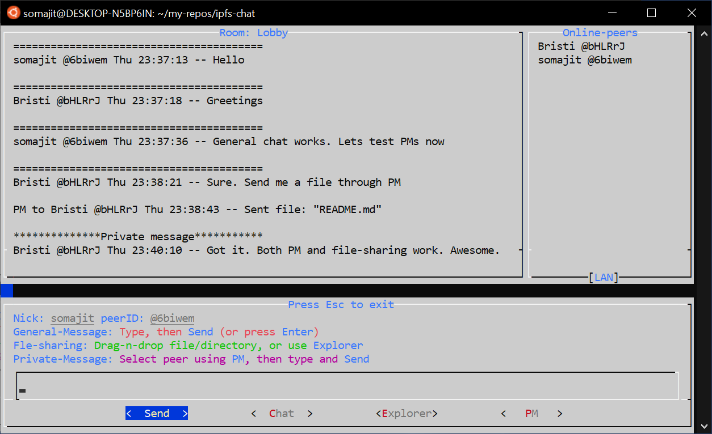

# IPFS-Chat

1. Real-time messaging using IPFS pubsub. Works over both internet and LAN.
2. The usual *Create Alias/Nick* + *Create/Join room* workflow (akin to IRC).
3. Peers are discovered using DHT and MDNS (See [Peer discovery](#peer-discovery)).
4. Chat-messages are authenticated and encrypted (See [Security](#security)).
5. Very basic terminal-based UI without any eye candy.
6. Written entirely in Bash.

## Usage

```shell
ipfs-chat -r <room> -n <nick> -d <download directory> -c <ipfs repo>
ipfs-chat -g # Generating a random room name, for when your brain can't do it
ipfs-chat -h # Help
```

## Snapshot



## Peer discovery

Name of the room is the shared secret. 

Every participant provides a file at regular intervals whose content is a time-based nonce derived from the shared secret, viz. the room name. 

To join the room, one needs to connect to as many online participants as possible. This is done by first querying the DHT for the provider of the nonce file and then swarm connecting to that peer. For establishing direct connection, the multiaddress of any given peer ID is retrieved by querying the DHT. To accommodate for peers leaving and joining the room, the query and swarm connect steps are iterated at regular intervals. 

Peers behind NAT use autorelay or p2p-circuit to be accessible.

Local discovery is also enabled ([Discovery.MDNS.Enabled=true](https://github.com/ipfs/go-ipfs/blob/master/docs/config.md)).

If a peer sees a message (over pubsub) from a peer that it is not directly connected to, it tries to connect to it immediately.

## Security

Authenticity of the messages is established through IPNS over pubsub (See [Messaging](#messaging))

All messages are encrypted with a symmetric key derived from the room name using HMAC.

The pubsub topic is a separate HMAC key derived from the room name. 

Therefore, the public network, that mediates the pubsub and passes the messages along, never knows the actual room name and hence, the encryption key.

Before deriving the keys, the room name is itself hashed using a memory- and CPU-hard password-hashing algorithm ([Argon2](https://github.com/P-H-C/phc-winner-argon2)) [Not implemented yet].

## Messaging

Every peer publishes its nick and a self-signed PGP ed25519 pubkey under its peer ID over IPNS at the start of the session. This authenticates its claim over the nick and pubkey.

After discovering a peer, Other peers resolve its IPNS entry and caches its nick and pubkey for use throughout the session.

For messaging, a peer signs the message with its private key and encrypts with the aforementioned symmetric key derived from the room name. The whole encrypted object is encoded in base64 and published over pubsub along with the sender's peer ID.

Other peers receive this over pubsub, decrypt the message and verify the signature. If everything is ok, they then display the message in their UI against the sender's nick, peer ID and timestamp.

[IPNS-pubsub](https://github.com/ipfs/go-ipfs/blob/master/docs/experimental-features.md#ipns-pubsub) is enabled to aid in resolving IPNS names as quickly as possible.

## Future directions

1. Lowering bandwidth usage. Keep disconnecting from irrelevant peers.
2. Making peer discovery more efficient. Advertise peer multiaddresses over pubsub. Cache chatroom peers as bootstrap nodes or [Peering.Peers](https://github.com/ipfs/go-ipfs/blob/master/docs/config.md#peering).
3. Secure file sharing. Files to be shared can simply be dragged and dropped in the text-input area. Support for WSL.
4. Using Argon2 for more security (See [Security](#security)).
5. Private messages: To PM a peer simply prefix your message with @nick(peer ID).
6. Offline mode such that even if a peer goes offline, it can obtain the missed messages when it comes back online [This may well be beyond my capabilities].

## Bug-reports and Feedbacks

Post at [issues](https://github.com/SomajitDey/ipfs-chat/issues) and [discussion](https://github.com/SomajitDey/ipfs-chat/discussions), or [write to me](mailto://hereistitan@gmail.com).

------

###### [GNU GPL v3-or-later](https://github.com/SomajitDey/ipfs-chat/blob/main/LICENSE) &copy; 2021 Somajit Dey
